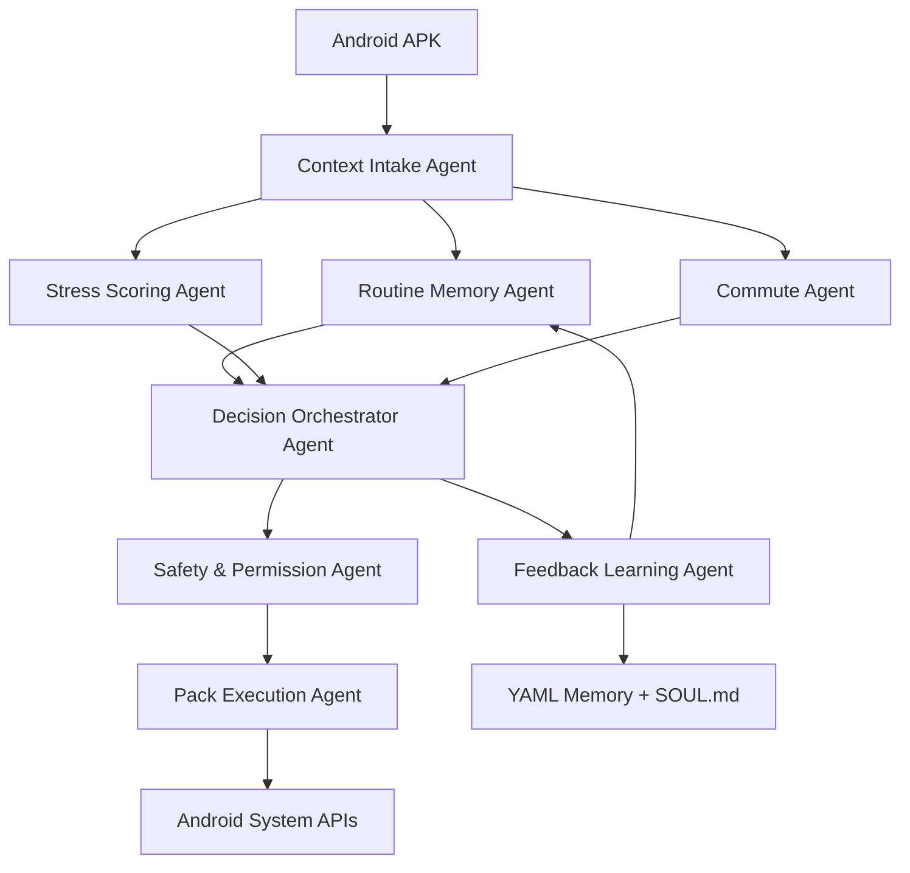

# CAPE Production Architecture

## System Shape

CAPE is split into two cooperating systems:

1. Android APK: sensing, local scoring, user interface, permissions, and pack execution.
2. OpenClaw control plane: multi-agent orchestration, session logging, durable memory, natural-language overrides, and feedback learning.

## OpenClaw Orchestration

The CAPE gateway HTTP server is only the Android transport edge. Each
`/v1/context/decision` request is delegated to the OpenClaw orchestrator.

When `OPENCLAW_BASE_URL` and `OPENCLAW_TOKEN` are configured, CAPE connects to
the upstream OpenClaw Gateway over its WebSocket protocol, sends an `agent`
request to `OPENCLAW_AGENT_ID` (default `cape`), and expects OpenClaw to return
the final CAPE decision JSON. This makes OpenClaw the owner of the multi-agent
session, workspace context, routing, and transcript storage. Set
`OPENCLAW_REQUIRED=true` for strict demos where CAPE must fail instead of falling
back when OpenClaw is unavailable.

If OpenClaw is not configured or is unavailable and strict mode is off, CAPE uses
the local fallback orchestrator to preserve the Android demo pipeline. Fallback
responses are marked with `openclaw.runtime = "local-fallback"` and include a
fallback reason.

The local fallback follows the same deterministic agent order, records the agent
trace, and writes context/session logs under `openclaw/runtime`.

Runtime outputs:

- `events.jsonl`: append-only event stream for context decisions and feedback.
- `context-log.jsonl`: normalized and memory-hydrated context snapshots per session.
- `session-log.jsonl`: compact OpenClaw session index.
- `sessions/<sessionId>.json`: full per-session trace, decision, and context.
- `latest-context.json`, `latest-summary.md`, `latest-session.md`: current demo state.

Required OpenClaw environment:

- `OPENCLAW_BASE_URL`: upstream OpenClaw Gateway, usually `http://127.0.0.1:18789`.
- `OPENCLAW_TOKEN`: shared-secret token for the Gateway WebSocket handshake.
- `OPENCLAW_AGENT_ID`: CAPE agent workspace id, default `cape`.
- `OPENCLAW_AGENT_METHOD`: OpenClaw request method, default `agent`.
- `OPENCLAW_REQUIRED`: set `true` to disable fallback.

OpenClaw workspace files live under `openclaw/`:

- `AGENTS.md`: CAPE multi-agent ordering and strict JSON contract.
- `SOUL.md`: policy, consent, and user-respect rules.
- `TOOLS.md`: CAPE gateway/tool conventions.
- `IDENTITY.md`: CAPE agent identity.
- `USER.md`: local demo/user preferences.

## Agents

- Context Intake Agent: validates raw Android context events and converts them to normalized features.
- Routine Memory Agent: reads and writes routine, commute, and preference memory.
- Stress Scoring Agent: computes explainable stress score with reason codes.
- Commute Agent: calculates leave-by time and alert urgency.
- Decision Orchestrator Agent: chooses the behavior pack and action plan.
- Safety & Permission Agent: blocks low-confidence, unsafe, or unauthorized actions.
- Pack Execution Agent: applies Android DND, volume, brightness, wallpaper, and alerts through Android System APIs only after Safety & Permission approval.
- Feedback Learning Agent: converts feedback and natural-language overrides into memory updates.

## MVP Demo Flow

1. User had poor sleep proxy and has many meetings.
2. Android sends normalized context to CAPE core.
3. Stress score crosses high threshold.
4. Commute Agent detects traffic pressure for next meeting.
5. Orchestrator selects `office_focus_high_stress`.
6. Safety Agent verifies DND and settings permissions.
7. Pack Execution Agent applies vibrate, DND, brightness, and the focus wallpaper.
8. Feedback Agent asks whether the action was useful and updates memory.
