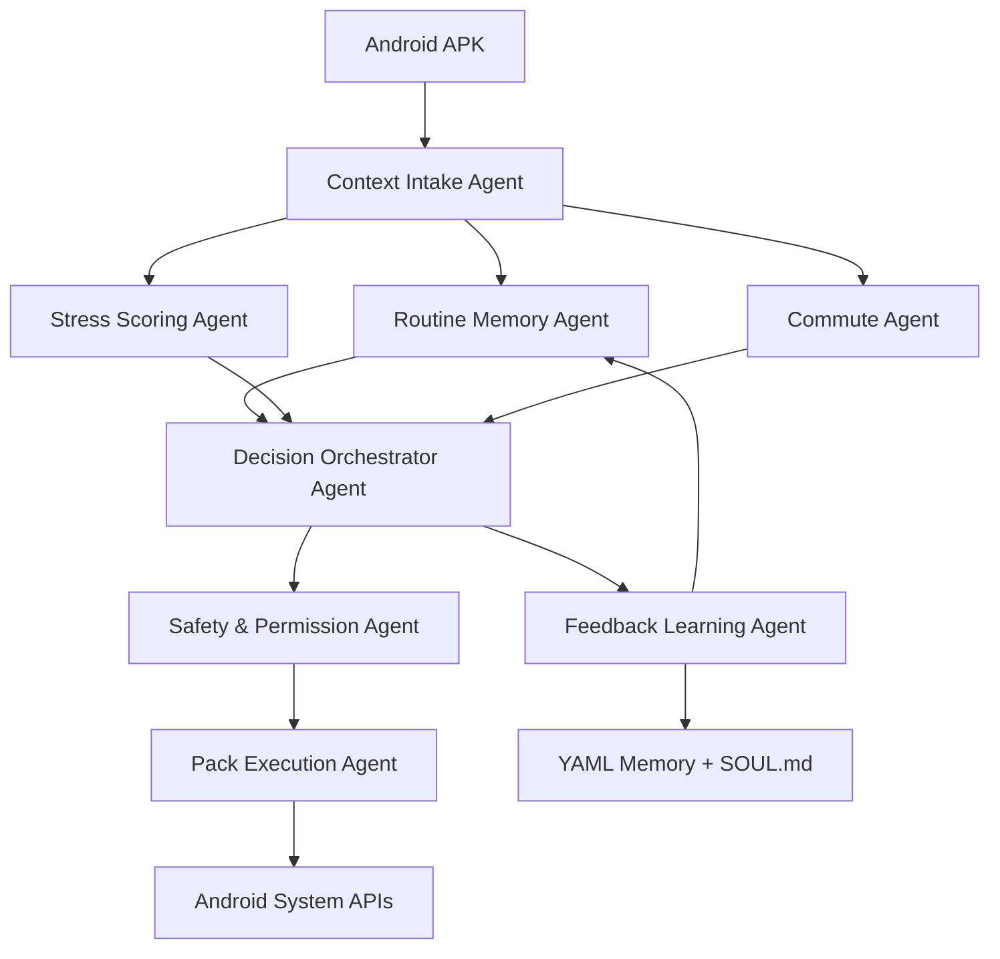

# CAPE Production Architecture

## System Shape

CAPE is split into two cooperating systems:

1. Android APK: sensing, local scoring, user interface, permissions, and pack execution.
2. OpenClaw control plane: multi-agent reasoning, durable memory, natural-language overrides, and feedback learning.

## Agents

- Context Intake Agent: validates raw Android context events and converts them to normalized features.
- Routine Memory Agent: reads and writes routine, commute, and preference memory.
- Stress Scoring Agent: computes explainable stress score with reason codes.
- Commute Agent: calculates leave-by time and alert urgency.
- Decision Orchestrator Agent: chooses the behavior pack and action plan.
- Safety & Permission Agent: blocks low-confidence, unsafe, or unauthorized actions.
- Pack Execution Agent: applies Android DND, volume, brightness, wallpaper, and alerts.
- Feedback Learning Agent: converts feedback and natural-language overrides into memory updates.

## MVP Demo Flow

1. User had poor sleep proxy and has many meetings.
2. Android sends normalized context to CAPE core.
3. Stress score crosses high threshold.
4. Commute Agent detects traffic pressure for next meeting.
5. Orchestrator selects `office_focus_high_stress`.
6. Safety Agent verifies DND and settings permissions.
7. Pack Execution Agent applies vibrate, DND, and brightness.
8. Feedback Agent asks whether the action was useful and updates memory.
